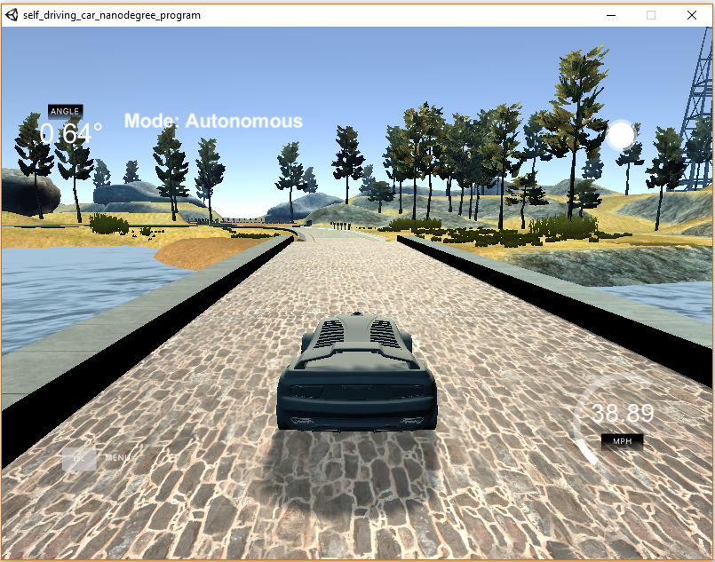

# CarND-Controls-PID

## Overview
This repository contains the work I did within **Project #9 of Udacity's Self-Driving Car Nanodegree Program** (fourth project of second term). Objective of this project is to **design a PID controller** to have a car navigate on a simulator track. Implementation is done in **C++**. 

For this we use the car driving simulator that Udacity has developed and that we already used for Project #3 (Behavorial Cloning). For that project  objective was the same (drive the car around the car) but using a deep learning approach. 

*Snapshot of Udacity's driving simulator*

## Project writeup

### Introduction 
In this project we implement a PID controller to maintain the car in the center of the track. We can also add another controller to control the car speed, which I did. 

The simulator provides the cross track error (CTE) and the velocity (mph). These values are fed in their dedicated controller to compute the appropriate steering angle and throttle.

There is no requirement on car speed. I set the speed to **40** mph while the maximum possible speed is 100 mph. The higher the speed the more difficult it is to remain on track! 

### PID controller
Three components are part of the PID controller:
* Proportional component: provides a correction directly proportional to the error. If too big can, can creates oscillations. If too small, convergence is too long.
* Integral: running sum of previous errors. Enables to correct for small residual biases.
* Derivative: provides a correction proportional to the rate of change of the error. Is useful to smooth oscillations provided by the two previous components.

In my implementation, following the advices I found in this [document](http://georgegillard.com/documents/2-introduction-to-pid-controllers), I chose to reset the integral component term in two cases: 
* when error was 0 (actually less than 0.001). Indeed when reaching zero error, integral term is non zero and this results in additional correction which is not needed anymore. 
* when error is too big because in that case the integral term is going to become too big. I chose to set it to zero when error is bigger than **1.0**

### Controller tuning 
Tuning a controller consists in finding the three coefficients (Kp, Ki, Kd) that will provide the best car behaviour. It is really problem specific and is not obvious!

#### Speed
This one does not require to be fine funed as we don't care if the car's speed oscillates a bit or is not strictly at the desired value. So I just used a P controller with coefficient equal to 0.3. In the end the speed is not perfectly adjusted on the desired value but this is not a big deal.

#### Steering angle
The tuning of this controller is really tricky. There are several methods to tune a PID controller. See [this link ](https://en.wikipedia.org/wiki/PID_controller) for some examples.
In class, we learnt a method called Twiddle. [Here](https://www.youtube.com/watch?v=2uQ2BSzDvXs) is a video where Sebastian Thrun details it. An implementation in Python can be found [there](https://martin-thoma.com/twiddle/). It is a method wich enables to find a local minimum of a function. In our case the function to minimize is the SSE (sum of squared error) of the cross track error. I chose to compute the SSE over 2500 time steps, with removal of the first 200 ones, because the loop is not stabilized yet. Time step depends on your computer and on the resolution of the simulator one chooses. With what I chose, the time step was approximatively 0.030 s, that is, it took one minute to perform a parameter configuration run. Overall the whole twiddle optimization may take several hours depending on the stopping criteria that is chosen.
I implemented this method but it did not provide good results when starting from scratch (that is all three parameters set to 0). Indeed I did not end with a parameter configuration able to keep the car on the track.

I thus decided to manually look for parameters. I used Ziegler-Nichols method (see description at the end of this [link](https://www.thorlabs.com/tutorials.cfm?tabID=5dfca308-d07e-46c9-baa0-4defc5c40c3e). I ended up with the following set of 3 parameters [Kp=0.03, Ki=0.012, Kd=0.011]. However the car could not pass the first turn with this configuration! I played a bit with these values to improve the car behaviour and have it pass the first turns. The final values I used as initial input for twiddle were [Kp=0.045, Ki=0.008, Kd=0.015].
After a lot of iterations, Twiddle ended up with the following parameter configuration: [ , , ]

A video of the car driving a lap can be found in the ./video repository.

## Repository content

The repository includes the following files:

 - source code in the */src* folder
	 - main.cpp : communicates with the Simulator, receiving observations (speed, cross-track error), runs the PID controllers and send back actuator commands (steering angle and throttle). 
	 - PID.cpp:  implements PID controller, compute error and implement Twiddle algorithm
 	 - twiddle.cpp: initializes the Twiddle algorithm
 	 - json.hpp: JSON is used for communication with simulator

 - CMakeLists.txt: file that is used by CMAKE to build the project 
 - video.mp4: a video of the car driving a lap at 30 mph

## Dependencies

* cmake >= 3.5
* make >= 4.1(mac, linux), 3.81(Windows)
* gcc/g++ >= 5.4
* [uWebSockets](https://github.com/uWebSockets/uWebSockets)
* Simulator: it can be download [here](https://github.com/udacity/self-driving-car-sim/releases).

## Basic Build Instructions

1. Clone this repo.
2. Make a build directory: `mkdir build && cd build`
3. Compile: `cmake .. && make`
4. Run it: 
	* no arguments provided: `./pid`
		* it takes the following default coefficient values for steer PID controller: [0.03, 0.0005, 0.3]
	* providing the steer PID controller coefficients : `./pid Kp_value Ki_value Kp_value ` 
	* using twiddle: `./pid filename Kp_value Ki_value Kp_value 1 filename`; for example `./pid outfile.txt 0.3 0.001 0.1 1 output.txt`
		* will perform twiddle starting with the provided input coefficients 

